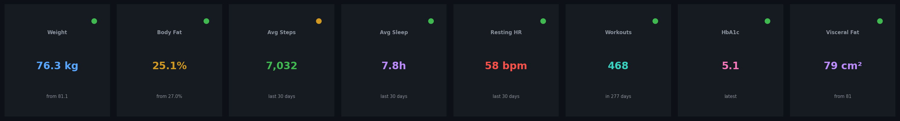
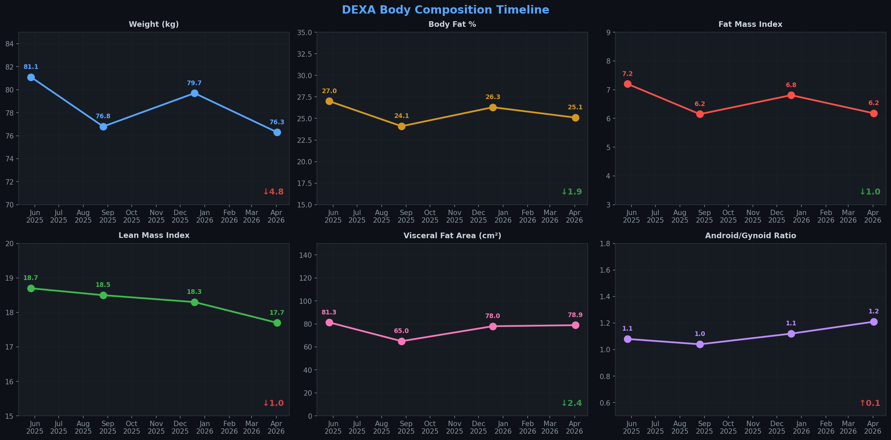
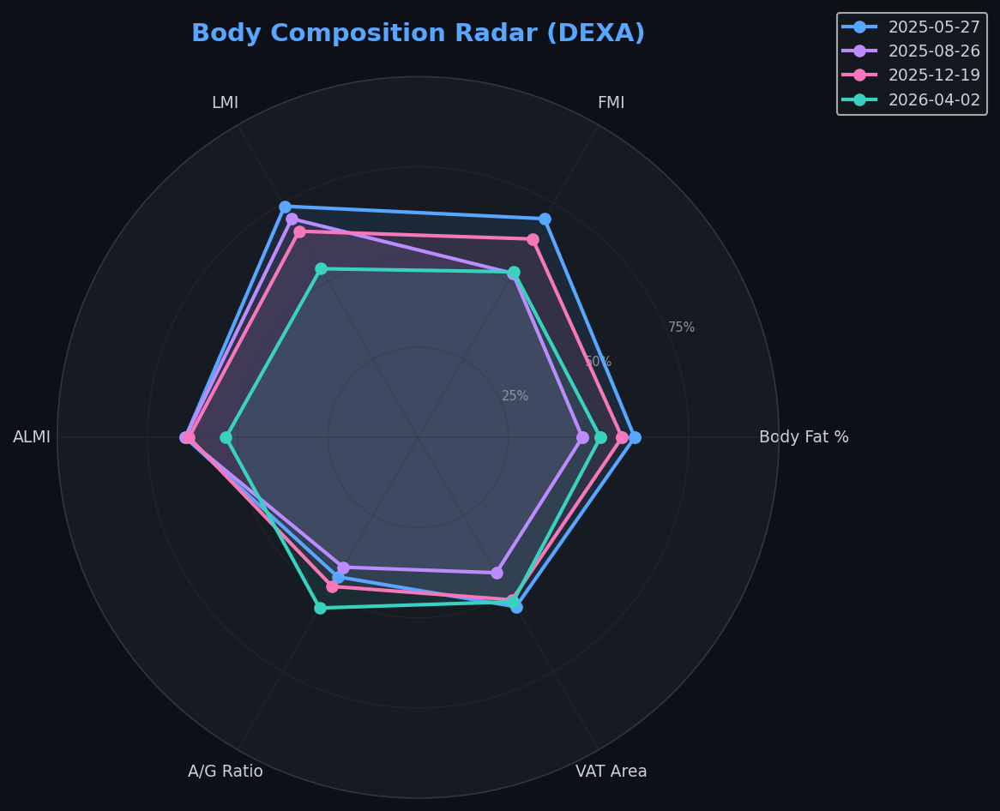
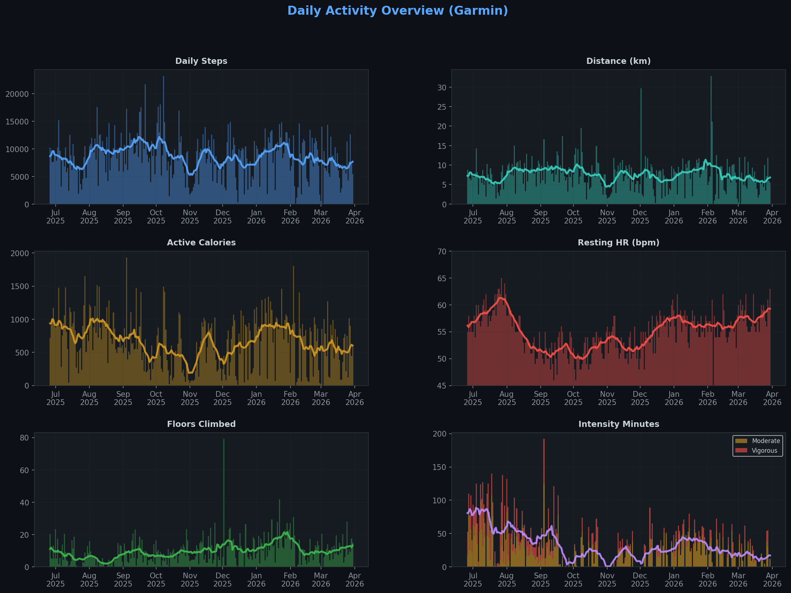
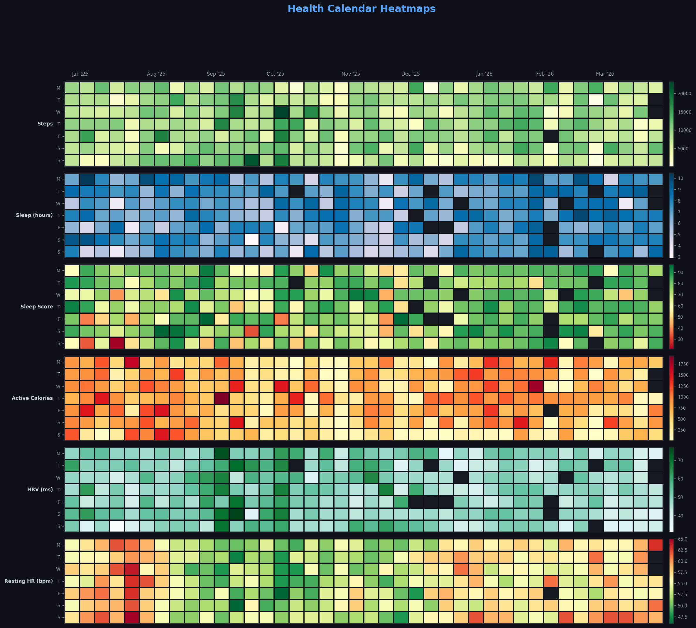
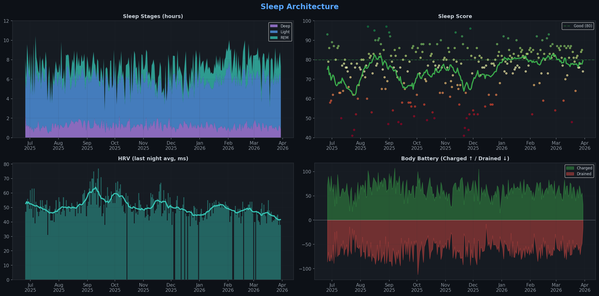
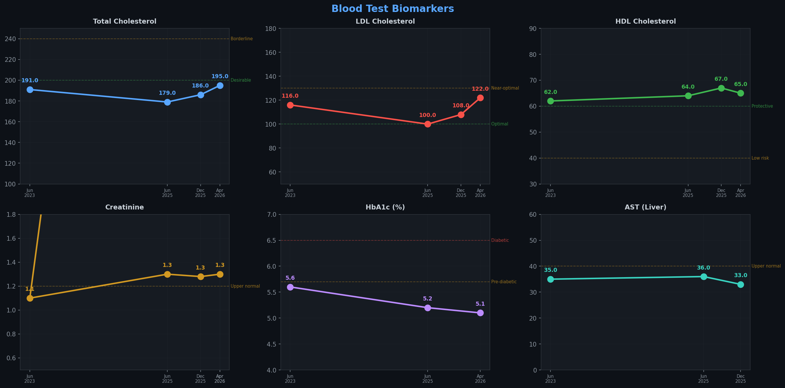
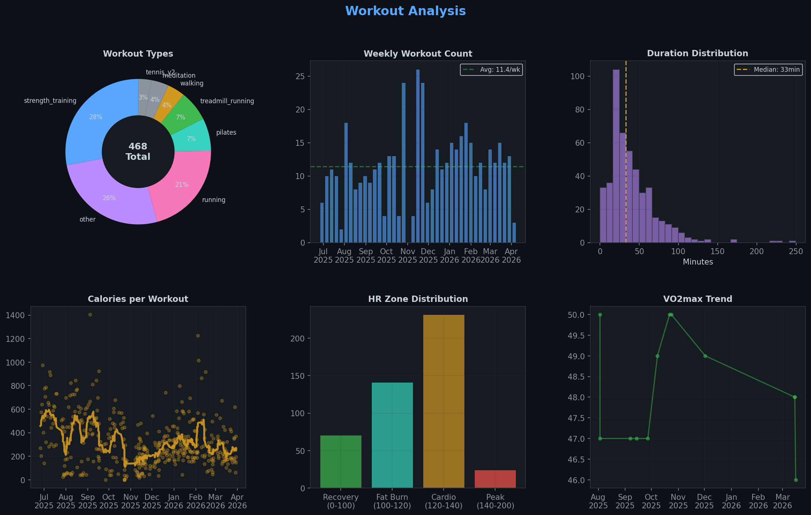
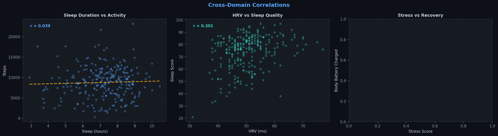

# 🏥 Health Tracker Dashboard

> Automated health data visualization from Garmin, DEXA scans, blood tests, and cognitive assessments.  
> Charts auto-regenerate via GitHub Actions on data push.  
> **[→ Interactive Dashboard (GitHub Pages)](https://ksk5429.github.io/health_tracker/)**

---

## 📊 Key Metrics



---

## 🦴 Body Composition (DEXA)

4 whole-body DXA scans tracking bone density, lean mass, fat distribution, and visceral adipose tissue.



<details>
<summary>🔬 DEXA Radar — Normalized Body Composition Profile</summary>



</details>

---

## 🏃 Daily Activity (Garmin)

278 days of continuous tracking: steps, distance, calories, heart rate, floors climbed, and intensity minutes.



### 📅 Health Calendar Heatmaps

6 metrics as GitHub-style contribution calendars — aligned to visually correlate patterns across days.



---

## 😴 Sleep Architecture

Nightly sleep stages (deep, light, REM), sleep scoring, HRV trends, and body battery recovery balance.



---

## 🩸 Blood Biomarkers

4 comprehensive blood panels (Jun 2023 → Apr 2026): lipid profile, metabolic markers, liver/kidney function, thyroid.



---

## 💪 Workout Analysis

468 tracked workouts: type distribution, weekly frequency, duration patterns, HR zones, VO2max progression.



---

## 🔗 Cross-Domain Correlations

How sleep, stress, HRV, and activity interact across the full dataset.



---

## 📁 Data Sources

| Source | Records | Date Range | Format |
|--------|---------|------------|--------|
| Garmin Daily | 278 days | Jun 2025 – Mar 2026 | JSON |
| Garmin Activities | 468 workouts | Jun 2025 – Mar 2026 | CSV |
| DEXA Scans | 4 scans | May 2025 – Apr 2026 | Excel |
| Blood Tests | ~150 markers | Jun 2023 – Apr 2026 | Excel |
| Grip Strength | 1 measurement | Apr 2026 | CSV |
| N-back Cognitive | 5 sessions | Mar 2026 | CSV |

## 🛠️ How It Works

```
data/          ← Raw data (Garmin JSON, Excel, CSV)
scripts/
  etl.py       ← Parse all sources → data/processed/*.csv
  generate_charts.py      ← Matplotlib charts → dashboard/charts/
  generate_interactive.py ← Plotly HTML → dashboard/interactive/
dashboard/
  charts/      ← SVG + PNG for README
  interactive/ ← Plotly HTML for GitHub Pages
```

### Regenerate Charts

```bash
pip install -r requirements.txt
python scripts/etl.py
python scripts/generate_charts.py
python scripts/generate_interactive.py
```

### Add New Data

1. Drop new Garmin JSONs into `data/garmin/`
2. Update Excel files in `data/dexa/` or `data/blood_tests/`
3. Run the pipeline or push to trigger GitHub Actions

---

## 📜 License

Personal health data — not for redistribution. Code is MIT.
